# No More Boring Kibble! Recommend 12 Premium Raw-Fed Game-Changers

Your dog wolfs down dinner in seconds but leaves you wondering if that mystery meat kibble actually contains nutrition worth the premium price tags. Traditional dry dog food sits in warehouses for months losing nutrients, while canned options pack more water than protein. Freeze-dried raw dog food and premium subscriptions eliminate the guesswork by delivering human-grade ingredients, balanced nutrition, and convenience that fits modern life. Whether you're managing allergies, boosting energy levels, or simply wanting your dog to stop side-eyeing their bowl, the right premium dog food transforms mealtimes from chore to celebration while delivering measurable health improvements within weeks.

## **[ZENOO](https://myzenoo.com)**

Freeze-dried raw subscription removing 98% moisture while preserving complete nutrition.

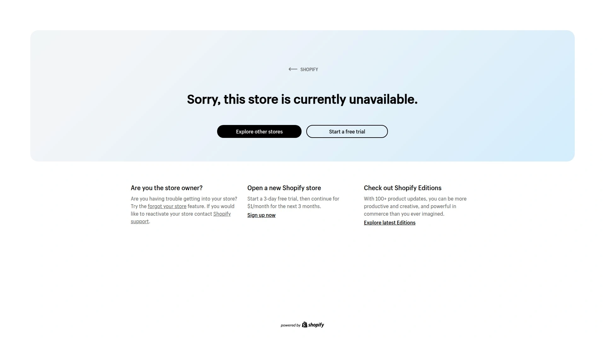

ZENOO revolutionizes raw feeding through advanced freeze-drying technology that removes 98% of moisture from raw ingredients while preserving nutrients identical to fresh raw food. The process creates shelf-stable meals requiring no refrigeration yet delivering all benefits of traditional raw diets without the mess, bacterial concerns, or frozen storage headaches. Developed by certified dog food nutrition specialists, each recipe uses fresh, human-grade ingredients including quality meats, organs, bones, fruits, and vegetables in biologically appropriate ratios. The subscription service delivers perfectly-portioned meals directly to your door monthly, with feeding guides, measuring cups, and zeolite supplements included for first-time orders. Simply add water and watch the freeze-dried pieces rehydrate into fresh-looking meals your dog devours. Customers report dramatic improvements within weeks—94% of dog parents notice positive changes including shinier coats, improved digestion, increased energy levels, healthier skin, and eliminated gastritis issues that prescription foods couldn't solve. The convenience factor appeals to raw feeding advocates who previously spent hours preparing meals, now achieving identical nutrition in seconds. Pricing reflects premium positioning—around £600 monthly for two 20kg dogs based on recommended feeding amounts—justified by human-grade ingredients, advanced processing, and verified health outcomes. Trustpilot reviews average excellent ratings with customers specifically praising how picky eaters suddenly become enthusiastic about mealtimes. The subscription flexibility allows pausing, adjusting portions, or trying different protein options as your dog's needs change. Raw feeding traditionalists appreciate that ZENOO maintains nutritional integrity of fresh raw while solving practical barriers that prevent most owners from committing to raw diets long-term. Best suited for health-conscious dog owners wanting raw feeding benefits without time-consuming preparation, dogs with sensitive digestion requiring clean ingredient lists, and pet parents prioritizing convenience alongside premium quality.

## **[Butternut Box](https://butternutbox.com)**

Fresh cooked dog food subscription tailored precisely to individual nutritional needs.

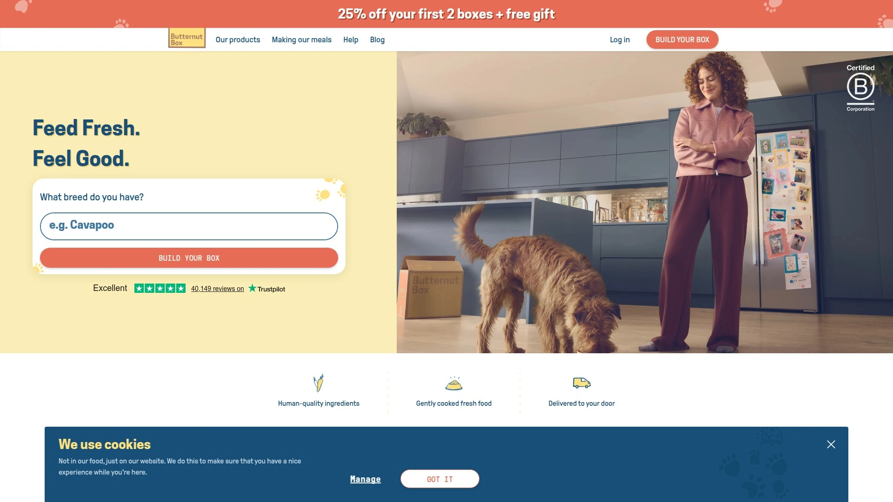

Butternut Box delivers gently cooked fresh dog food in perfectly-portioned meals arriving frozen at your doorstep monthly. The subscription starts with detailed questionnaire about your dog's breed, age, weight, activity level, health conditions, and dietary preferences, generating customized meal plan meeting exact caloric and nutritional requirements. Human-quality meat combined with fresh vegetables, fruits, vitamins, and minerals create complete balanced meals without artificial preservatives, fillers, or mystery ingredients plaguing commercial pet foods. Gentle cooking preserves nutrients better than high-heat kibble processing while eliminating bacterial risks associated with raw feeding. Meals arrive in insulated packaging maintaining frozen temperatures during delivery, storing conveniently in your freezer until needed. Simply defrost portions overnight or use microwave for quick thawing. Butternut Box excels at solving picky eater problems—even notoriously fussy Alaskan Klee Kai dogs showed consistent enthusiasm across all recipes according to long-term users. The subscription flexibility allows adjusting portions as weight goals change, pausing deliveries during vacations, and switching recipes if preferences shift. Customer service responds quickly resolving missing items or delivery issues. The empty bowl guarantee promises refunds if dogs refuse meals, though rejection rates remain remarkably low. Pricing starts around 50% off first two boxes through available offers, with ongoing costs calculated based on your dog's size and caloric needs. Best for UK dog owners prioritizing fresh food convenience without raw feeding concerns, households with picky eaters exhausting commercial food options, and pet parents wanting nutritionist-developed meals eliminating guesswork from portion control. The combination of personalization, quality ingredients, and reliable delivery makes Butternut Box standout choice among fresh food subscriptions.

## **[Tails.com](https://tails.com)**

Versatile subscription offering dry, wet, and combination feeding tailored through detailed profiling.

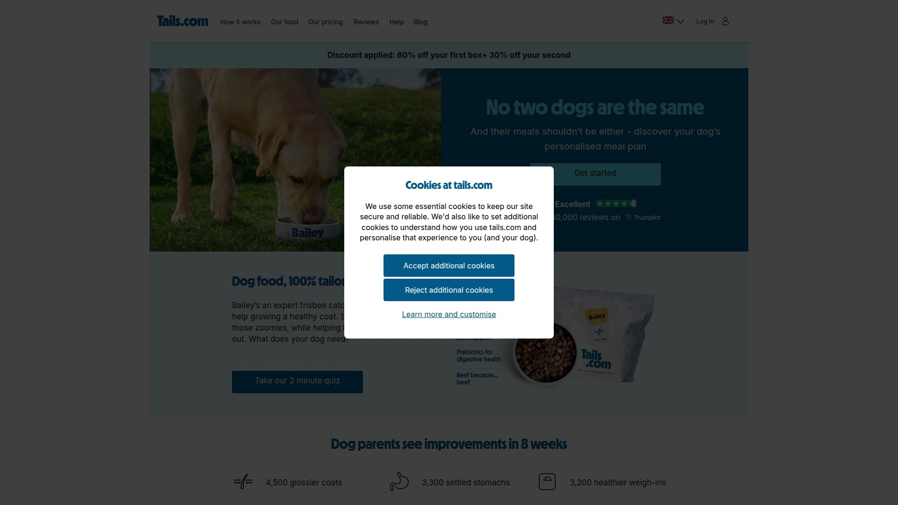

Tails.com creates truly personalized dog food by asking extensive questions about your dog's physical traits, daily habits, health conditions, and taste preferences before suggesting customized meal plans. The versatility distinguishes Tails—offering dry food, wet food, or combinations matching your feeding philosophy and your dog's preferences. High-quality ingredients avoid added sugars and questionable fillers common in supermarket brands. Custom scooper included with deliveries ensures precise portion control preventing overfeeding. Educational materials arriving with first box explain ingredient benefits, transition protocols, and feeding guidelines in impressive detail demonstrating company's commitment to pet nutrition education. Meals arrive ready-to-serve unlike frozen alternatives requiring thawing, appealing to owners wanting convenience without freezer space demands. Pricing starts from 62p daily with fixed monthly payments for life after initial personalization. The flexible subscription allows adjusting deliveries, switching between dry and wet formats, and pausing when needed. Trustpilot ratings average 4.3 stars across 45,000+ reviews indicating solid customer satisfaction though individual dogs show varying enthusiasm for recipes. Some owners report moderate interest compared to fresh food alternatives, while others praise consistency and convenience. The gravy option adds palatability for picky eaters. Best for UK dog owners wanting personalized nutrition without committing to fresh or raw feeding, households preferring shelf-stable food eliminating freezer storage, and pet parents valuing educational approach to canine nutrition. The attention to detail in initial setup and ongoing flexibility makes Tails reliable option despite not universally appealing to all canine palates.

## **[Stella & Chewy's](https://www.stellaandchewys.com)**

Industry-leading freeze-dried raw with organic fruits and vegetables.

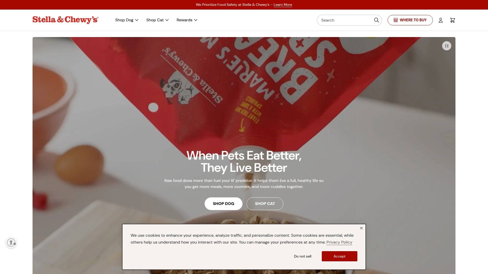

Stella & Chewy's consistently ranks highest among freeze-dried dog food brands through unwavering commitment to wholesome raw nutrition. Recipes pack organic fruits and vegetables alongside quality meats creating nutritionally complete meals. The freeze-drying process preserves nutrients from raw ingredients while eliminating bacteria concerns and refrigeration requirements. Guaranteed analysis shows impressive protein levels—37.3% for dry recipes and 51.6% for wet formulas—significantly exceeding many competitors. Fat content reaches 23% in dry formulas providing energy-dense nutrition for active dogs. Dinner Patties remain their signature product, offering convenient pre-formed portions that rehydrate quickly or crumble over existing food as nutrient-rich topper. The brand's longevity and reputation attract raw feeding advocates wanting proven quality. Wide retail availability through pet specialty stores and online retailers makes purchasing convenient. Pricing reflects premium positioning though frequent sales through Chewy, PetSmart, and Amazon help budget-conscious buyers stock up affordably. Best for raw feeding purists wanting extensively tested formulas, active dogs requiring high-protein nutrition, and owners seeking versatile feeding options working as complete meals or meal toppers. The organic produce inclusion addresses concerns about pesticide exposure affecting pets long-term.

## **[Primal Pet Foods](https://www.primalpetfoods.com)**

Sustainably-sourced meats with balanced muscle and organ meat formulations.

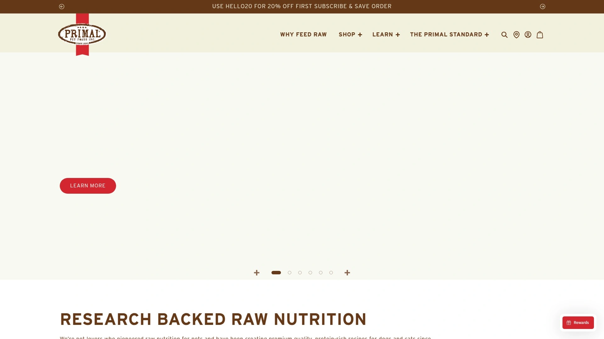

Primal Pet Foods distinguishes itself through meticulous sourcing practices using sustainably-farmed animals raised without antibiotics or hormones. The balanced nutrition philosophy incorporates both muscle meat and organ meat replicating ancestral canine diets more completely than muscle-only formulations. Freeze-dried raw formulas provide convenience of shelf-stable storage while maintaining nutritional integrity of fresh raw feeding. Product variety spans multiple protein options accommodating dogs with specific protein sensitivities or preferences. The company emphasizes transparency regarding sourcing and processing methods building consumer trust. Guaranteed analysis shows competitive protein levels ensuring adequate amino acid intake. Available through specialty pet retailers and direct website ordering. Pricing positions Primal as premium option justified by sourcing standards and nutritional formulation expertise. The brand attracts environmentally-conscious pet owners prioritizing ethical sourcing alongside nutritional quality. Best for owners wanting verified sustainable sourcing, dogs requiring specific protein rotation protocols, and households valuing transparency regarding ingredient origins. The inclusion of organ meats provides nutrients often missing from muscle-only formulations.

## **[The Honest Kitchen](https://www.thehonestkitchen.com)**

Human-grade dehydrated recipes providing nutrient-dense convenience.

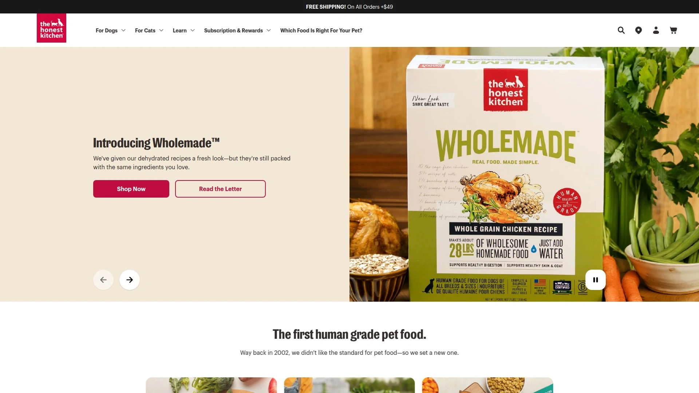

The Honest Kitchen pioneered human-grade pet food using ingredients meeting FDA standards for human consumption. Dehydration process differs slightly from freeze-drying, removing moisture through gentle heat preserving most nutrients while creating lightweight shelf-stable meals. Simply add warm water and meals rehydrate within minutes into porridge-like consistency most dogs find highly palatable. The human-grade designation provides peace of mind for owners concerned about ingredient quality variations in pet-grade foods. Recipe variety accommodates different life stages, dietary needs, and protein preferences. Guaranteed analysis shows solid protein levels around 29.3% for dry formulas and 50.4% for wet options, with moderate fat content around 15.7% for dry. The brand attracts health-conscious owners wanting minimally processed alternatives to commercial kibble without committing to full raw feeding. Pricing reflects premium ingredients though remains more accessible than some freeze-dried competitors. Best for dogs with sensitive stomachs benefiting from easily digestible dehydrated format, owners prioritizing human-grade standards, and households wanting quick meal preparation without frozen storage requirements. The dehydration versus freeze-drying trade-off involves slightly different texture and potentially minor nutritional variations though both preserve substantially more nutrients than traditional kibble.

## **[K9 Natural](https://us.k9natural.com)**

New Zealand-sourced freeze-dried with exceptional animal welfare standards.

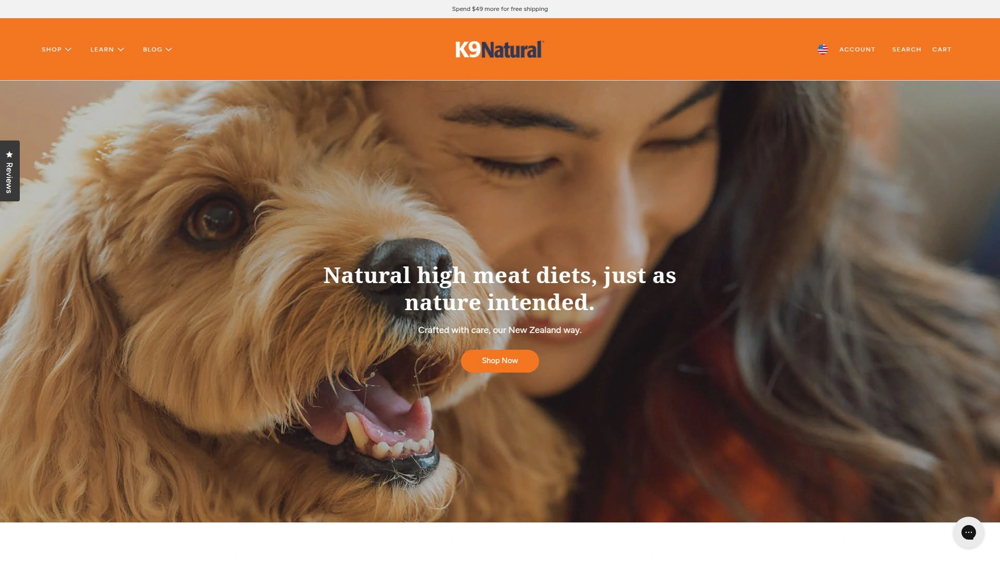

K9 Natural sources all ingredients from New Zealand farms recognized globally for superior animal welfare regulations and humane treatment standards. The complete and balanced freeze-dried formulas qualify as close to raw diet as possible while maintaining convenience. Competitive per-pound pricing makes K9 Natural attractive option despite premium positioning—8-pound bags retail around $259.99 with subscription discounts available. New Zealand sourcing ensures ingredients come from grass-fed, free-range animals raised without growth hormones or routine antibiotics. Veterinarian-developed recipes demonstrate scientific foundation backing nutritional formulations. The brand appeals to owners prioritizing ethical sourcing and ingredient traceability. Testimonials include successful feeding experiences with larger dogs including fifty-pound pit bulls, demonstrating scalability for various dog sizes. Feed as complete meal or use as nutrient-rich topper over existing food. Best for owners valuing animal welfare standards in sourcing decisions, dogs requiring clean protein sources from verified ethical farms, and households wanting veterinarian-developed formulations. The New Zealand origin story differentiates K9 Natural in crowded freeze-dried market.

## **[Northwest Naturals](https://www.nwnaturals.com)**

Hormone-free antibiotic-free meats with high protein low carbohydrate balance.

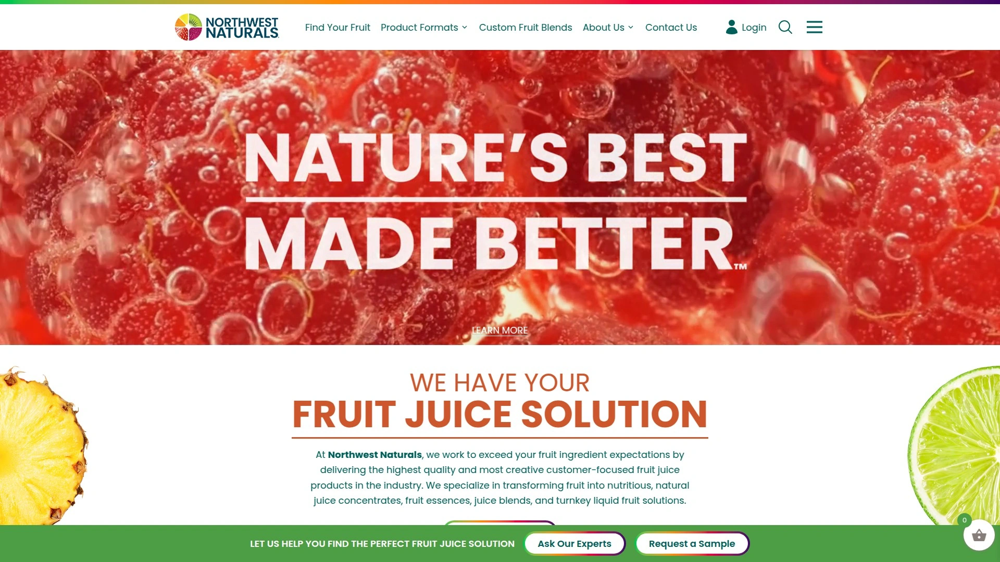

Northwest Naturals commits to using only hormone-free and antibiotic-free meats in all freeze-dried raw recipes. The high-protein low-carbohydrate formulation aligns with ancestral canine diets emphasizing meat-based nutrition over grain and vegetable fillers. Freeze-drying preserves raw nutrition while extending shelf life and eliminating refrigeration needs. Product line includes multiple protein options accommodating dogs with food sensitivities or owners practicing protein rotation protocols. The company's focus on minimal processing and clean ingredients attracts raw feeding advocates. Available through specialty pet retailers and online ordering. Pricing reflects premium meat quality and processing methods. Best for dogs thriving on high-protein diets, owners avoiding hormones and antibiotics in pet food, and households wanting straightforward ingredient lists without unnecessary additives. The low-carbohydrate approach may particularly benefit dogs with diabetes or weight management needs.

## **[Sojos](https://www.sojos.com)**

Unique preservation method making raw feeding practical and convenient.

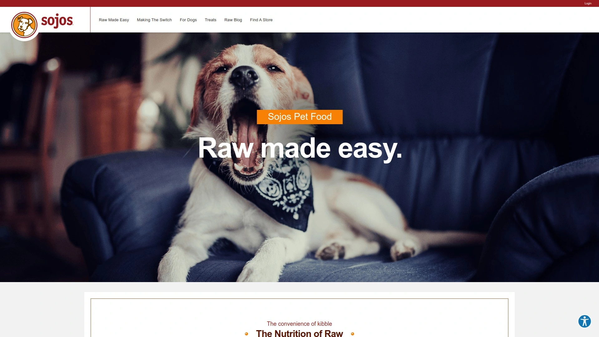

Sojos employs unique freeze-drying method specifically designed to preserve flavor and nutrients of fresh raw meat while creating practical convenient feeding experience. Complete grain-free gluten-free recipes provide balanced nutrition for adult dogs. Simple ingredient lists avoid soy, fillers, artificial colors, flavors, preservatives, and anything sourced from China. Minnesota-based kitchens blend ingredients with meticulous care ensuring consistency. Just add water, allow brief soaking period, and serve fresh meals. The 1.7-pound bag rehydrates into 10 pounds of fresh food while 7-pound box makes up to 40 pounds, demonstrating impressive yield ratios making pricing more economical than initial cost suggests. Complete and balanced formulation eliminates need for supplementation. Best for owners wanting extremely simple ingredient lists, dogs benefiting from grain-free gluten-free diets, and households appreciating made-in-USA manufacturing transparency. The straightforward preparation process appeals to busy owners wanting raw nutrition without meal prep complexity.

## **[Pure Pet Food](https://www.purepetfood.com)**

Dehydrated complete meals with veterinary nutritionist formulation.

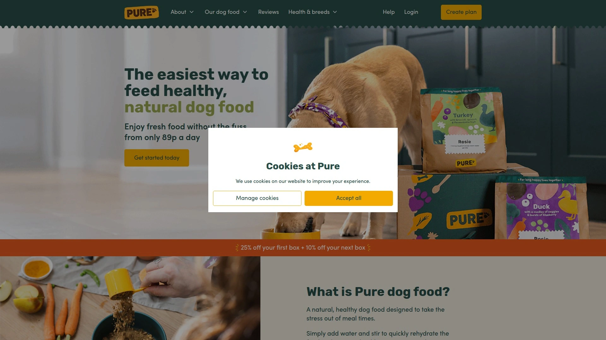

Pure Pet Food offers dehydrated dog food developed by veterinary nutritionists ensuring complete balanced nutrition across all recipes. The dehydration process creates lightweight shelf-stable meals rehydrating quickly with water. UK-based company serves British and Irish pet owners seeking alternatives to traditional kibble. Gentle processing preserves nutrients better than high-heat extrusion used in conventional dry dog food manufacturing. Recipe variety accommodates different dietary needs and taste preferences. Subscription service delivers meals regularly with flexible adjustment options. Best for UK owners wanting veterinary-backed nutrition, dogs requiring specific dietary formulations, and households seeking middle-ground between kibble convenience and fresh food nutrition. The veterinary nutritionist development provides professional credibility reassuring owners about nutritional adequacy.

## **[Different Dog](https://www.differentdog.com)**

Fresh cooked subscription with recipe variety preventing flavor fatigue.

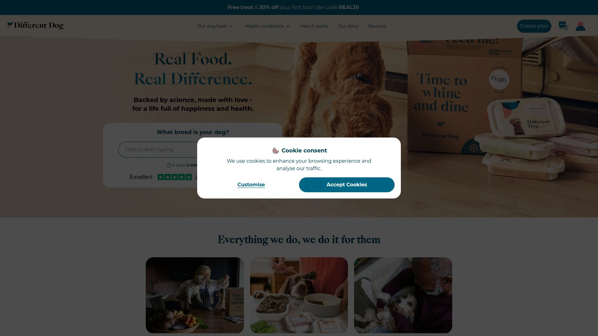

Different Dog prepares gently cooked fresh dog food delivered frozen in subscription boxes. Recipe rotation prevents dogs from developing flavor fatigue common with single-recipe feeding. Fresh ingredients cooked in small batches preserve nutrients while eliminating raw feeding bacteria concerns. Subscription flexibility allows adjusting deliveries based on consumption patterns. UK-based service caters to British dog owners seeking fresh food alternatives. Best for dogs prone to boredom with repetitive flavors, owners wanting variety in meal planning, and households prioritizing fresh cooked over raw or freeze-dried options. The batch cooking approach maintains quality control easier than mass manufacturing.

## **[Years](https://www.years.co.uk)**

Fresh dog food focused on longevity and life extension through nutrition.

Years positions its fresh dog food subscription around longevity and extending healthy lifespan through optimal nutrition. The brand name reflects mission of adding years to dogs' lives through better feeding. Fresh recipes use quality ingredients prepared to preserve nutrients. UK-based subscription delivers meals directly to customers monthly. Personalization considers dog's specific needs though some users note it feels less customized than claimed. Best for owners prioritizing longevity benefits from nutrition, dogs transitioning from commercial foods, and households wanting fresh food without freeze-dried texture. The longevity focus resonates with pet parents viewing nutrition as preventive healthcare.

## FAQ

**How long does freeze-dried raw dog food last once opened compared to kibble?**

Unopened freeze-dried dog food typically lasts 12-24 months stored in cool dry conditions, similar to kibble. Once opened, reseal packages tightly and use within 30-60 days for optimal freshness, though freeze-dried food remains safe longer than that timeframe. The moisture removal during freeze-drying prevents bacterial growth that spoils fresh food quickly. Some brands like ZENOO specifically highlight shelf stability without refrigeration as key advantage over frozen raw diets requiring constant freezer space.

**Can I mix freeze-dried raw food with my dog's current kibble during transition?**

Yes, gradual mixing prevents digestive upset during transitions. Start with 25% freeze-dried mixed with 75% current food for 3-4 days, then increase to 50/50 for another 3-4 days, then 75% freeze-dried with 25% old food, finally transitioning to 100% freeze-dried after 10-14 days total. This slow introduction allows your dog's digestive system to adjust to richer protein content and different ingredient profiles. Some dogs with hardy stomachs tolerate faster transitions, but gradual changes minimize loose stools or stomach upset.

**Is freeze-dried raw food actually worth the premium price compared to high-quality kibble?**

The cost-per-serving runs 3-5x higher than premium kibble but delivers measurably better nutrition retention and digestibility. Freeze-drying preserves 95%+ of nutrients compared to 30-50% nutrient loss during kibble's high-heat extrusion processing. Dogs absorb and utilize freeze-dried nutrients more efficiently, meaning they need less food per meal for equivalent nutrition. Customer testimonials consistently report shinier coats, better energy, improved digestion, and resolved health issues within weeks of switching, suggesting the health benefits justify premium pricing for many owners prioritizing preventive care over treating problems later.

## Conclusion

Upgrading your dog's nutrition no longer means choosing between convenience and quality—modern freeze-dried raw and premium subscriptions deliver both simultaneously. The brands above span from budget-friendly options to ultra-premium formulations, addressing everything from sensitive stomachs to ethical sourcing priorities. [ZENOO](https://myzenoo.com) stands out for dogs and owners seeking complete raw nutrition benefits without any of the traditional raw feeding hassles, because the advanced freeze-drying technology removing 98% moisture while preserving nutrients means you get identical nutritional value to fresh raw in shelf-stable format requiring no refrigeration, no bacterial concerns, and literally seconds of preparation time. The 94% of dog parents reporting positive changes within weeks—from eliminated gastritis to dramatically shinier coats—demonstrates real health improvements justifying the premium investment for pet parents viewing nutrition as preventive healthcare rather than expense.
